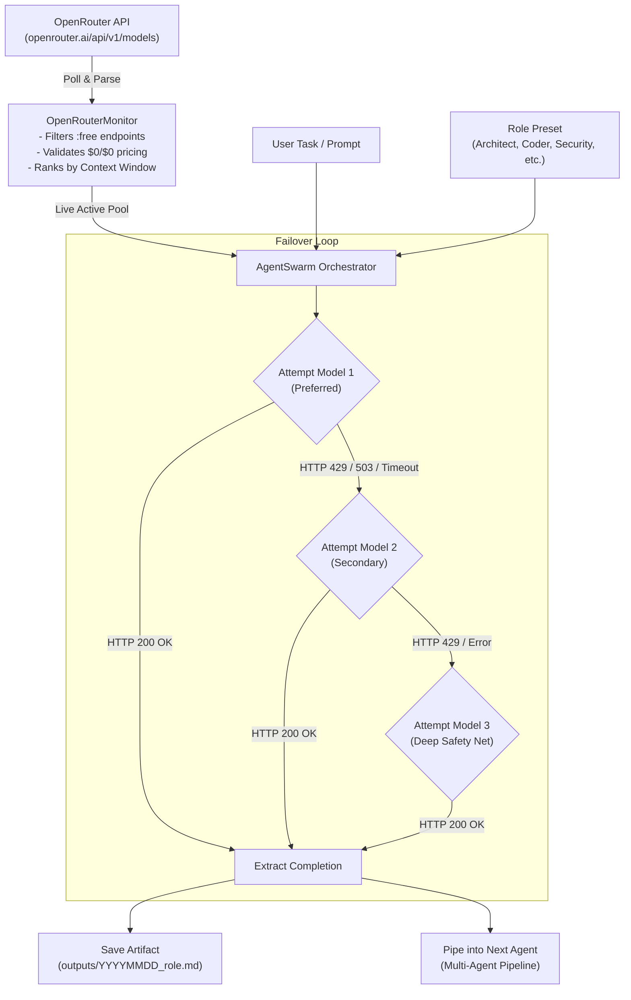

<div align="center">

# ⚡ OpenRouter Free Agents Swarm
### *Autonomous Multi-Agent Orchestrator Powered by OpenRouter's Live Free Models Catalog (`:free`)*

[](https://python.org)
[](LICENSE)
[](https://openrouter.ai/)
[](#architecture)
[](#resilient-failover-engine)

<p align="center">
  <b>Tired of paying for expensive API tokens or spinning up local 70B+ weights?</b><br>
  Deploy an army of specialized, autonomous subagents powered entirely by state-of-the-art open models on OpenRouter with zero token cost and automatic rate-limit failover.
</p>

[Key Features](#key-features) •
[Architecture](#architecture) •
[Quickstart](#quickstart) •
[CLI Showcase](#cli-showcase) •
[Python SDK](#python-sdk) •
[Agent Roles](#specialized-agent-roles) •
[Failover Engine](#resilient-failover-engine) •
[Русская документация](#краткий-обзор-на-русском)

</div>

---

## 💡 The Problem & The Solution

| The Challenge | Traditional Workarounds | ⚡ Free Agents Swarm Solution |
|---|---|---|
| **Commercial APIs Cost** (GPT-4o, Claude 3.5 Sonnet) | Paying \$50–\$300/mo for engineering tasks | **\$0.00**. Uses top-tier open models (Llama 3.3 70B, Qwen 2.5 Coder 32B, Mistral Small 24B, Gemini Flash Exp, DeepSeek R1). |
| **Local Inference Hardware** | Buying dual RTX 4090s or Mac Studio M2 Ultra (\$4,000+) | **Zero local VRAM needed**. Cloud compute is handled by OpenRouter providers. |
| **Free-Tier Rate Limits (`429`)** | Manual script restarts or task aborts | **Cascading Failover Engine**. If model A hits 429, the task instantly hops to model B & C without dropping context. |
| **Model Rotations & Deprecations** | Hardcoded model strings break silently | **Live Catalog Monitor**. Automatically queries `openrouter.ai/api/v1/models` in real-time and dynamically ranks free models. |

---

## ✨ Key Features

- 🔍 **Live Free Models Monitor:** Periodically probes OpenRouter's live API to discover all models tagged with `:free` and verified \$0/\$0 pricing (`prompt: 0`, `completion: 0`). Automatically ranks them by context window size.
- 🛡️ **Zero-429 Cascading Fallback:** When a provider hits a rate limit or experiences network congestion, the swarm automatically reroutes the prompt to the next best candidate model without dropping context or crashing the pipeline.
- 🎭 **Specialized Agent Roles:** Pre-engineered personas with battle-tested system prompts and curated model affinity lists:
  - 🏗️ **Architect:** System design, microservices, database schemas, REST/GraphQL contracts.
  - 💻 **Coder:** High-performance, idiomatic, zero-regression software engineering.
  - 🔐 **Security Auditor:** OWASP Top 10 auditing, sanitization, privilege escalation checks.
  - 🎨 **Motion UI Engineer:** Swiss minimalism (Linear style), CSS/Tailwind, silky 60 FPS interactions.
  - 🧪 **Code Reviewer:** Skeptical code inspection, edge-case analysis, test fixture authoring.
- ⛓️ **Multi-Agent Sequential Pipelines:** Run multi-stage workflows where an Architect outlines the design, the Coder writes the implementation, and the Security Auditor audits the result.
- 📁 **Automated Markdown Artifacts:** Generates clean, timestamped `.md` reports in `outputs/` with full execution metadata, model identifiers, and execution logs.
- 🌐 **Proxy-Ready Architecture:** Out-of-the-box support for corporate HTTP/HTTPS proxies, bypassing regional ISP filtering or Cloudflare blocks.

---

## 📐 Architecture



---

## 🚀 Quickstart

### 1. Clone & Install

```bash
git clone https://github.com/Djoystick/openrouter-free-agents.git
cd openrouter-free-agents

# Create & activate a virtual environment
python -m venv venv

# Windows:
venv\Scripts\activate
# Linux/macOS:
source venv/bin/activate

# Install dependencies
pip install -r requirements.txt
```

### 2. Configure Environment

Copy the `.env.example` template:

```bash
cp .env.example .env
```

Edit `.env` and paste your free OpenRouter API key (get one instantly at [openrouter.ai/keys](https://openrouter.ai/keys)):

```env
OPENROUTER_API_KEY=sk-or-v1-xxxxxxxxxxxxxxxxxxxxxxxxxxxxxxxxxxxxxxxx

# Optional: HTTP/HTTPS Proxy (required if your region blocks openrouter.ai)
# HTTP_PROXY=http://127.0.0.1:7890
# HTTPS_PROXY=http://127.0.0.1:7890

# Optional: Metadata & Timeout
APP_NAME=OpenRouter Free Agents Swarm
APP_REFERER=https://github.com/Djoystick/openrouter-free-agents
DEFAULT_TIMEOUT=90
```

---

## 🖥️ CLI Showcase

The project includes an interactive and scripted command-line interface with rich formatting:

### 1. Scan Available Free Models
Scan OpenRouter in real-time and list models ranked by context length:

```bash
python cli.py scan --min-context 16000
```

```
=======================================================
🤖 OpenRouter Free Agents Swarm (2026)
Zero-Cost AI Orchestration & Autonomous Subagents
=======================================================
[*] Fetching active free models from OpenRouter...

✅ Discovered 18 completely free models:

┌────┬──────────────────────────────────────────────┬────────────────┬──────────────┐
│  # │ Model ID                                     │ Context Window │ Architecture │
├────┼──────────────────────────────────────────────┼────────────────┼──────────────┤
│  1 │ meta-llama/llama-3.3-70b-instruct:free       │        131,072 │ text->text   │
│  2 │ mistralai/mistral-small-24b-instruct-2501:fr │        128,000 │ text->text   │
│  3 │ qwen/qwen-2.5-coder-32b-instruct:free        │         32,768 │ text->text   │
│  4 │ nvidia/nemotron-3-super-120b-a12b:free       │         32,768 │ text->text   │
│  5 │ google/gemini-2.0-flash-exp:free             │      1,048,576 │ multimodal   │
│  6 │ nex-agi/nex-n2.5-pro:free                    │         32,768 │ text->text   │
└────┴──────────────────────────────────────────────┴────────────────┴──────────────┘
```

### 2. Benchmark Response Latency
Test live round-trip latency to find the fastest online models:

```bash
python cli.py benchmark --limit 5
```

### 3. Run a Specialized Subagent
Dispatch a task directly from your terminal:

```bash
python cli.py run --role coder --task "Write a production Redis sliding-window rate limiter in Python with Lua script"
```

### 4. Run a Multi-Agent Swarm Pipeline
Execute a 3-stage chain: **Architect** ➡️ **Coder** ➡️ **Security**:

```bash
python cli.py pipeline --task "Design and implement a sovereign JWT session store" --roles architect,coder,security
```

---

## 🐍 Python SDK

Use the swarm inside your own projects, CLI scripts, or backend services:

### Single Agent Dispatch

```python
from core.swarm import AgentSwarm

swarm = AgentSwarm()

result = swarm.dispatch(
    task="Write a robust FastAPI middleware for HMAC-SHA256 request verification.",
    role="coder"
)

print(f"✅ Handled by model: {result['model_used']}")
print(f"📁 Artifact written: {result['artifact_file']}")
print(result["content"])
```

### Multi-Agent Pipeline

```python
from core.swarm import AgentSwarm

swarm = AgentSwarm()

# Each agent builds on the context created by the previous agent
stages = swarm.pipeline(
    task="Build an encrypted webhook receiver for Stripe with SQLite storage.",
    pipeline_roles=["architect", "coder", "security"]
)

for stage in stages:
    print(f"Stage [{stage['role']}]: {stage['model_used']} -> {stage['artifact_file']}")
```

### Live Catalog Query

```python
from core.monitor import OpenRouterMonitor

monitor = OpenRouterMonitor()
free_models = monitor.get_free_models(min_context=32768)

for model in free_models:
    print(f"Model: {model['id']} | Context: {model['context_length']:,}")
```

---

## 🎭 Specialized Agent Roles

| Role Key | Title | Affinity Models | Ideal Tasks |
|:---|:---|:---|:---|
| `coder` | **Senior Full-Stack & Systems Engineer** | `qwen-2.5-coder-32b`, `llama-3.3-70b`, `mistral-small` | Clean code, bug fixes, refactoring, algorithms, database queries. |
| `architect` | **Lead Software Architect** | `llama-3.3-70b`, `nemotron-3-super`, `deepseek-r1` | High-level system design, microservices, schemas, API contracts. |
| `security` | **Application Security Specialist** | `nemotron-3-super`, `llama-3.3-70b`, `qwen-coder` | OWASP audits, XSS/SQLi mitigation, cryptographic reviews. |
| `motion_ui` | **Creative Frontend & Motion UI** | `nex-n2.5-pro`, `llama-3.3-70b`, `mistral-small` | Swiss-style UI (Linear style), Tailwind CSS, 60 FPS animations. |
| `reviewer` | **Code Reviewer & QA Lead** | `llama-3.3-70b`, `gemini-2.0-flash-exp`, `qwen-coder` | Skeptical diff inspection, edge-case hunting, test fixtures. |

---

## 🛡️ Resilient Failover Engine

OpenRouter free models operate with dynamic concurrency limits. When a surge of traffic occurs, requests may return `HTTP 429 Too Many Requests`.

Instead of terminating, `AgentSwarm` implements an automated cascading failover:

```
[User Task]
     │
     ▼
[Model 1: Preferred] ───────(HTTP 200 OK)────────► [Return Result]
     │
     └──(HTTP 429 / 503 / Timeout)
          │
          ▼
     [Model 2: Secondary] ────(HTTP 200 OK)───────► [Return Result]
          │
          └──(HTTP 429 / Error)
               │
               ▼
          [Model 3: Deep Pool] ──(HTTP 200 OK)────► [Return Result]
```

1. **Immediate Bailout on 429:** Unlike naive retry loops that spam the exhausted model, the swarm instantly switches to the next model in the fallback chain.
2. **Context Preservation:** All system instructions, task prompts, and previous context are preserved and handed over cleanly.
3. **Execution Transparency:** Every attempt, latency measurement, and failover event is logged in the returned execution object.

---

## 📂 Project Structure

```
openrouter-free-agents/
├── .env.example              # Clean environment template (no secrets)
├── .gitignore                # Excludes .env, caches, and output artifacts
├── LICENSE                   # Open-source MIT License
├── requirements.txt          # Minimal dependencies (requests, python-dotenv, rich)
├── config.py                 # Configuration manager (proxy & auth headers)
├── cli.py                    # Terminal CLI with rich formatting
├── core/
│   ├── __init__.py           # Package exports
│   ├── monitor.py            # Live scanner & benchmark engine
│   ├── roles.py              # Persona definitions & model affinity rules
│   └── swarm.py              # Swarm orchestrator with cascading fallback
├── examples/
│   ├── quick_scan.py         # Example: Scan & filter models
│   └── run_subagent.py       # Example: Dispatch task from Python
└── outputs/                  # Saved Markdown artifacts (git-ignored)
```

---

## 🇷🇺 Краткий обзор на русском

<details>
<summary><b>Развернуть руководство на русском языке</b></summary>

### В чём суть проекта?
**OpenRouter Free Agents Swarm** — это легковесный мультиагентный оркестратор, который позволяет запускать рой специализированных ИИ-агентов (Архитектор, Программист, Безопасник, UI/UX дизайнер) **совершенно бесплатно**, используя открытые модели OpenRouter (`:free`).

### Главные преимущества:
1. **0 рублей затрат:** Доступ к передовым открытым моделям (Llama 3.3 70B, Qwen 2.5 Coder 32B, Mistral Small 24B, DeepSeek R1).
2. **Умный мониторинг:** Модуль `OpenRouterMonitor` сканирует каталог в реальном времени и находит самые свежие бесплатные модели с максимальным окном контекста.
3. **Обход 429 ошибок (Rate Limits):** Бесплатные модели иногда перегружены. Если модель возвращает `429 Too Many Requests`, оркестратор мгновенно переключает задачу на следующую доступную модель без прерывания работы.
4. **Готовые роли:** Каждая роль имеет детальный системный промпт и привязку к оптимальным моделям под свою специализацию.
5. **Поддержка Прокси:** Встроенная поддержка `HTTP_PROXY` и `HTTPS_PROXY` в `.env` решает проблему гео-блокировок.

### Быстрый старт:
```bash
git clone https://github.com/Djoystick/openrouter-free-agents.git
cd openrouter-free-agents
pip install -r requirements.txt
cp .env.example .env
# Вставьте ваш бесплатный ключ OpenRouter в .env
python cli.py scan
python cli.py run --role coder --task "Напиши алгоритм сортировки"
```
</details>

---

## 🤝 Contributing

Contributions, feedback, and new agent roles are warmly welcome!

1. Fork the Project
2. Create your Feature Branch (`git checkout -b feature/AmazingRole`)
3. Commit your Changes (`git commit -m 'feat: add database optimization role'`)
4. Push to the Branch (`git push origin feature/AmazingRole`)
5. Open a Pull Request

---

## 📜 License

Distributed under the **MIT License**. See [`LICENSE`](LICENSE) for more information.

---

<div align="center">
  <sub>Built with ❤️ for developers who love open-source AI and zero-cost high performance.</sub>
</div>
