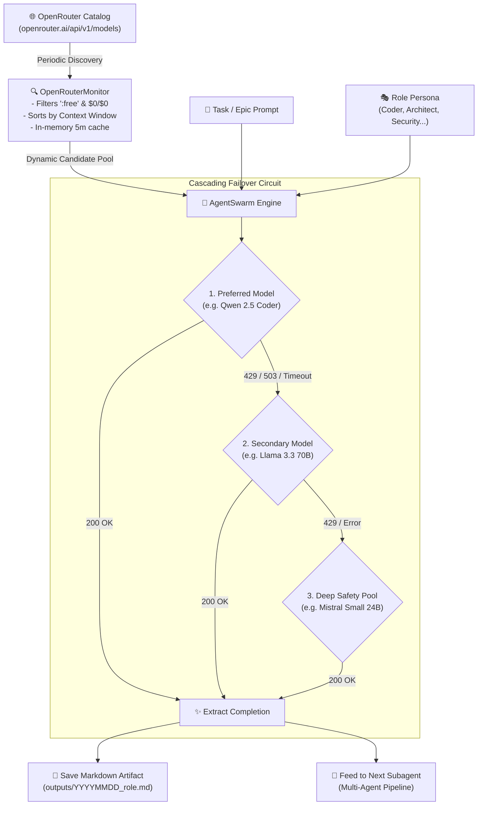

<div align="center">

```
  ___  ____  _____ _   _ ____   ___  _   _ _____ _____ ____  
 / _ \|  _ \| ____| \ | |  _ \ / _ \| | | |_   _| ____|  _ \ 
| | | | |_) |  _| |  \| | |_) | | | | | | | | | |  _| | |_) |
| |_| |  __/| |___| |\  |  _ <| |_| | |_| | | | | |___|  _ < 
 \___/|_|   |_____|_| \_|_| \_\\___/ \___/  |_| |_____|_| \_\
                 FREE AGENTS SWARM
```

### *Self-healing multi-agent orchestrator powered by OpenRouter's live zero-cost (`:free`) model catalog.*

[](https://python.org)
[](LICENSE)
[](https://openrouter.ai/)
[](https://github.com/Djoystick/openrouter-free-agents)
[](https://github.com/Djoystick/openrouter-free-agents)

<br/>

**Why burn money on API tokens or struggle with 24GB VRAM local setups when OpenRouter serves 70B+ weights for free?**  
`openrouter-free-agents` turns OpenRouter's rotating `:free` models into an autonomous team of specialized subagents, complete with live catalog discovery and seamless cascading failover whenever rate limits hit.

---

[Quickstart](#-quickstart-in-60-seconds) •
[Architecture](#-architecture--request-lifecycle) •
[Agent Personas](#-specialized-agent-personas) •
[CLI Showcase](#-cli-experience) •
[Python SDK](#-python-sdk) •
[The 429 Failover Engine](#-how-the-failover-engine-works) •
[Русский перевод](#-полный-обзор-на-русском)

---

</div>

<br/>

## 🎯 The Core Concept

OpenRouter regularly hosts cutting-edge open weights completely free of charge (`:free` suffix with `$0.00` pricing) — models like **Llama 3.3 70B**, **Qwen 2.5 Coder 32B**, **Mistral Small 24B**, and **Gemini Flash Experimental**.

However, using them in production or coding automation has always been a pain:
* ⚠️ **Rate Limit Walls (`HTTP 429`):** Free endpoints get throttled during traffic spikes.
* ⚠️ **Silent Provider Shifts:** Endpoints appear, get renamed, or run out of capacity without notice.
* ⚠️ **Context Mismatches:** Handing a massive refactoring task to a model with a tiny 8k window silently truncates your code.

> [!TIP]
> **What this package does:** It acts as an **intelligent load-balancer and agent scaffolding**. It monitors the live catalog, filters for high-context free models, assigns specialized roles (Coder, Architect, Security Auditor, UI Motion), and catches `429` errors on the fly — immediately failing over to the next candidate model without losing your prompt context.

---

## ⚡ Quickstart in 60 Seconds

### 1. Clone & Setup Virtualenv

```bash
git clone https://github.com/Djoystick/openrouter-free-agents.git
cd openrouter-free-agents

python -m venv venv

# Windows
venv\Scripts\activate
# Linux / macOS
source venv/bin/activate

pip install -r requirements.txt
```

### 2. Configure Your Free API Key

Get a key at [openrouter.ai/keys](https://openrouter.ai/keys) (no credit card required):

```bash
cp .env.example .env
```

Add your key to `.env`:

```env
OPENROUTER_API_KEY=sk-or-v1-your-key-here

# Optional: Add HTTP/HTTPS proxy if your network restricts openrouter.ai
# HTTP_PROXY=http://127.0.0.1:7890
# HTTPS_PROXY=http://127.0.0.1:7890
```

### 3. Run Your First Agent

```bash
python cli.py run --role coder --task "Write a Redis sliding-window rate limiter in Python with Lua script"
```

---

## 📊 Architecture & Request Lifecycle



---

## 🎭 Specialized Agent Personas

Each agent role comes with a tuned system prompt, optimal temperature, and a prioritized model affinity list:

| Role Key | Persona & Specialty | Model Affinity Chain | Temp | Output Focus |
|:---|:---|:---|:---:|:---|
| `coder` | **Senior Full-Stack Engineer** | `qwen-2.5-coder-32b` ➔ `llama-3.3-70b` ➔ `mistral-small` | `0.1` | Idiomatic code, zero regressions, type hints, edge-case coverage |
| `architect` | **Principal Solutions Architect** | `llama-3.3-70b` ➔ `nemotron-3-super` ➔ `deepseek-r1` | `0.2` | System design, database ER-diagrams, API contracts, milestones |
| `security` | **AppSec Specialist & Pen Tester** | `nemotron-3-super` ➔ `llama-3.3-70b` ➔ `qwen-coder` | `0.1` | OWASP Top 10, XSS/SQLi mitigations, timing attacks, audit reports |
| `motion_ui` | **Creative Frontend & Motion Dev** | `nex-n2.5-pro` ➔ `llama-3.3-70b` ➔ `mistral-small` | `0.3` | Swiss minimalism (Linear style), CSS/Tailwind, 60 FPS interactions |
| `reviewer` | **QA Lead & Skeptical Reviewer** | `llama-3.3-70b` ➔ `qwen-coder` ➔ `gemini-flash` | `0.1` | Code diff critique, dead code hunting, automated test fixtures |
| `general` | **Autonomous AI Assistant** | `llama-3.3-70b` ➔ `mistral-small` ➔ `gemini-flash` | `0.2` | Broad research, documentation, summarization |

> [!NOTE]
> Roles are defined in [`core/roles.py`](core/roles.py) and can be extended or customized in seconds.

---

## 💻 CLI Experience

The command-line interface (`cli.py`) is styled with `rich` formatting:

### 1. Scan Available Free Models
Polls the OpenRouter registry and prints currently available free models with their context windows:

```bash
python cli.py scan --min-context 16000
```

```console
=======================================================
🤖 OpenRouter Free Agents Swarm (2026)
Zero-Cost AI Orchestration & Autonomous Subagents
=======================================================
[*] Fetching active free models from OpenRouter...

✅ Discovered 16 completely free models:

┏━━━━┳━━━━━━━━━━━━━━━━━━━━━━━━━━━━━━━━━━━━━━━━━━━━━┳━━━━━━━━━━━━━━━━┳━━━━━━━━━━━━━━┓
┃  # ┃ Model ID                                    ┃ Context Window ┃ Architecture ┃
┡━━━━╇━━━━━━━━━━━━━━━━━━━━━━━━━━━━━━━━━━━━━━━━━━━━━╇━━━━━━━━━━━━━━━━╇━━━━━━━━━━━━━━┩
│  1 │ meta-llama/llama-3.3-70b-instruct:free      │        131,072 │ text->text   │
│  2 │ mistralai/mistral-small-24b-instruct-2501:f │        128,000 │ text->text   │
│  3 │ qwen/qwen-2.5-coder-32b-instruct:free       │         32,768 │ text->text   │
│  4 │ nvidia/nemotron-3-super-120b-a12b:free      │         32,768 │ text->text   │
│  5 │ google/gemini-2.0-flash-exp:free            │      1,048,576 │ multimodal   │
│  6 │ nex-agi/nex-n2.5-pro:free                   │         32,768 │ text->text   │
└────┴─────────────────────────────────────────────┴────────────────┴──────────────┘
```

### 2. Benchmark Response Latency
Probes top free models with a test payload to detect throttled providers before dispatching big tasks:

```bash
python cli.py benchmark --limit 5
```

```console
[*] Benchmarking top free models for latency and availability...
[*] Testing meta-llama/llama-3.3-70b-instruct:free...
[*] Testing qwen/qwen-2.5-coder-32b-instruct:free...

📊 Benchmark Results:
┏━━━━━━━━━━━━━━━━━━━━━━━━━━━━━━━━━━━━━━━━━━━━━┳━━━━━━━━┳━━━━━━━━━━━━━┳━━━━━━━┓
┃ Model ID                                    ┃ Status ┃ Latency (s) ┃ Notes ┃
┡━━━━━━━━━━━━━━━━━━━━━━━━━━━━━━━━━━━━━━━━━━━━━╇━━━━━━━━╇━━━━━━━━━━━━━╇━━━━━━━┩
│ meta-llama/llama-3.3-70b-instruct:free      │ ONLINE │        1.82 │ OK    │
│ qwen/qwen-2.5-coder-32b-instruct:free       │ ONLINE │        1.14 │ OK    │
└─────────────────────────────────────────────┴────────┴─────────────┴───────┘
```

### 3. Run a Multi-Agent Swarm Pipeline
Chains subagents sequentially, passing the cumulative design and code from one agent to the next:

```bash
python cli.py pipeline \
  --task "Design and write a sovereign JWT authentication middleware with sliding refresh tokens" \
  --roles architect,coder,security
```

---

## 🐍 Python SDK

Integrate the orchestrator directly into your Python backends, Discord/Telegram bots, or local toolchains:

### Single Subagent Dispatch

```python
from core.swarm import AgentSwarm

swarm = AgentSwarm()

result = swarm.dispatch(
    task="Write an asynchronous connection pool manager in Python with context manager support.",
    role="coder"
)

print(f"🎉 Handled by: {result['model_used']}")
print(f"📁 Artifact written to: {result['artifact_file']}")
print(result["content"])
```

### Multi-Stage Pipeline

```python
from core.swarm import AgentSwarm

swarm = AgentSwarm()

# Each agent builds on top of the output of preceding agents
stages = swarm.pipeline(
    task="Build an idempotent Stripe webhook processor with SQLite idempotency keys.",
    pipeline_roles=["architect", "coder", "security"]
)

for stage in stages:
    print(f"[{stage['role'].upper()}] -> {stage['model_used']} -> {stage['artifact_file']}")
```

### Direct Catalog Inspection

```python
from core.monitor import OpenRouterMonitor

monitor = OpenRouterMonitor()
free_models = monitor.get_free_models(min_context=32768)

for m in free_models:
    print(f"• {m['name']} ({m['id']}) | Context: {m['context_length']:,}")
```

---

## 🛡️ How the Failover Engine Works

The number one challenge with free AI endpoints is **traffic spikes resulting in `HTTP 429 (Too Many Requests)`**.

Standard SDKs throw an exception or force long exponential sleeps. `openrouter-free-agents` treats free models as an ephemeral pool:

```
[Incoming Subagent Task]
           │
           ▼
   [Model 1: Qwen 2.5 Coder]  ────(200 OK)────► [Save & Return Output]
           │
      (HTTP 429 Rate Limit)
           │
           ▼
   [Model 2: Llama 3.3 70B]   ────(200 OK)────► [Save & Return Output]
           │
      (HTTP 503 Provider Congestion)
           │
           ▼
   [Model 3: Mistral Small]   ────(200 OK)────► [Save & Return Output]
```

1. **Instant Circuit Breaking:** When a `429` is detected, the engine doesn't hammer the provider. It immediately rotates to the next model in the affinity list.
2. **Context Preservation:** The exact prompt, role persona, and accumulated context are carried over untouched.
3. **Audit Trail:** The returned dictionary includes `execution_log` detailing every attempt, status code, and latency measurement.

---

## ⚙️ Configuration Reference

All settings can be placed in your local `.env` file or exported as environment variables:

| Variable | Type | Default | Description |
|:---|:---:|:---:|:---|
| `OPENROUTER_API_KEY` | `string` | *Required* | Your free OpenRouter API key (`sk-or-v1-...`) |
| `HTTP_PROXY` | `url` | `""` | Optional HTTP proxy (e.g. `http://127.0.0.1:7890`) |
| `HTTPS_PROXY` | `url` | `""` | Optional HTTPS proxy |
| `DEFAULT_TIMEOUT` | `int` | `90` | Network timeout per request in seconds |
| `APP_NAME` | `string` | `"OpenRouter Free Agents Swarm"` | Application title passed in headers |
| `APP_REFERER` | `url` | Repository URL | Referer header for OpenRouter analytics |

---

## 📁 Repository Structure

```
openrouter-free-agents/
├── .env.example              # Clean configuration template (no secrets)
├── .gitignore                # Safely ignores .env, pycache, outputs
├── LICENSE                   # Open-source MIT License
├── requirements.txt          # Lightweight dependencies (requests, python-dotenv, rich)
├── config.py                 # Environment, proxy, and header resolver
├── cli.py                    # Interactive and automated CLI interface
├── core/
│   ├── __init__.py           # Public exports
│   ├── monitor.py            # Live catalog discovery & latency benchmark
│   ├── roles.py              # Persona definitions & model affinity chains
│   └── swarm.py              # Orchestration dispatcher with cascading failover
├── examples/
│   ├── quick_scan.py         # 10-line script to inspect free models
│   └── run_subagent.py       # 15-line script to dispatch a task
└── outputs/                  # Auto-generated markdown artifacts (.gitkeep)
```

---

## 🇷🇺 Полный обзор на русском

<details>
<summary><b>Нажмите, чтобы развернуть подробное описание на русском языке</b></summary>

### В чём главная идея?
OpenRouter предоставляет огромную коллекцию топовых моделей с суффиксом `:free` и нулевой ценой ($0 / $0). Среди них такие гиганты, как **Llama 3.3 70B**, **Qwen 2.5 Coder 32B** и **Mistral Small 24B**.

Однако на практике использование бесплатных моделей упирается в две проблемы:
1. **Лимиты `429 Too Many Requests`:** при нагрузке провайдер временно блокирует вызовы.
2. **Ротация моделей:** провайдеры бесплатных моделей постоянно меняются, появляются новые версии, а старые уходят.

### Что делает этот инструмент:
* **Авто-сканер каталога:** скрипт обращается напрямую к `openrouter.ai/api/v1/models` и собирает все активные бесплатные модели, сортируя их по размеру контекста.
* **Каскадный обход ошибок (Failover):** если первая модель выдаёт `429` или падает по таймауту, оркестратор не завершает работу с ошибкой, а моментально перенаправляет задачу на вторую и третью модель из списка, сохраняя весь контекст.
* **5 готовых ролей:** Архитектор, Программист, Аудитор безопасности, UI/UX разработчик микроанимаций и Код-ревьюер.
* **Multi-Agent Pipeline:** возможность запустить конвейер `Архитектор -> Кодер -> Безопасник`, где каждый следующий агент анализирует результат работы предыдущего.
* **Поддержка Прокси:** если OpenRouter или Cloudflare блокируются вашим провайдером, просто укажите `HTTP_PROXY=http://127.0.0.1:7890` в `.env`.

### Команды консоли:
```bash
# 1. Посмотреть доступные бесплатные модели с контекстом от 16k
python cli.py scan --min-context 16000

# 2. Проверить скорость отклика серверов
python cli.py benchmark

# 3. Отдать задачу субагенту-программисту
python cli.py run --role coder --task "Напиши алгоритм LRU кэша на Python"

# 4. Запустить цепочку из 3 агентов
python cli.py pipeline --task "Разработай сервис сокращения ссылок" --roles architect,coder,security
```
</details>

---

## 🤝 Contributing

Issues, new role definitions, and pull requests are welcome!

1. Fork the repo.
2. Create your branch (`git checkout -b feature/awesome-role`).
3. Commit your changes (`git commit -m 'feat: add database tuning role'`).
4. Push to the branch (`git push origin feature/awesome-role`).
5. Open a Pull Request.

---

## 📜 License

This project is licensed under the [MIT License](LICENSE).
Feel free to use it in your personal, educational, or commercial automation workflows.
