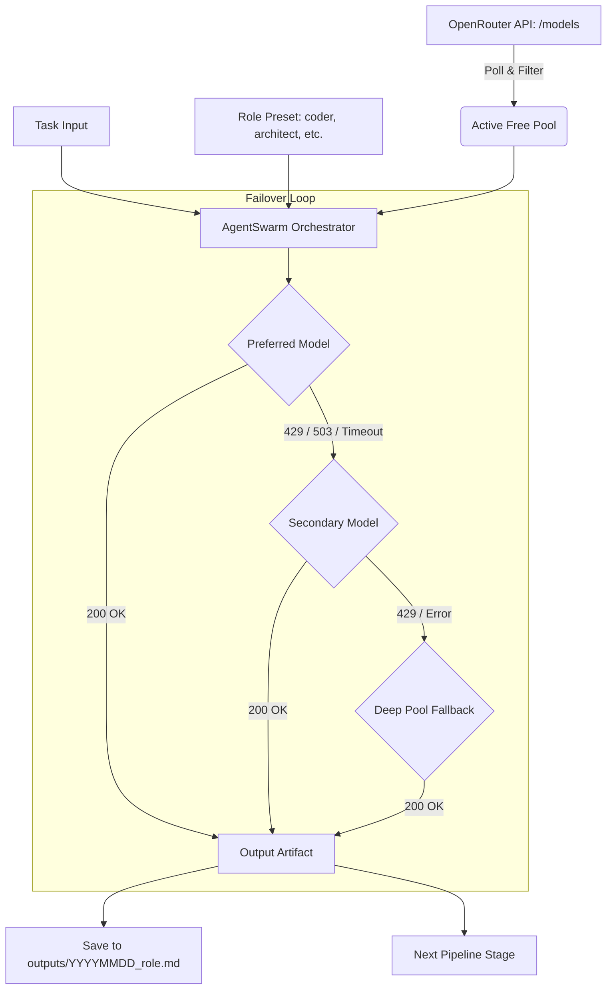

# openrouter-free-agents

[](https://www.python.org/)
[](LICENSE)

A Python library and CLI to orchestrate OpenRouter's free-tier (`:free`) models with automated catalog polling, role-based subagents, and cascading failover on rate limits (`HTTP 429`).

---

## Overview

OpenRouter maintains a rotating list of zero-cost models (`:free`), including weights like Llama 3.3 70B, Qwen 2.5 Coder 32B, and Mistral Small 24B. While useful for automation, background tasks, and code review, using these endpoints in scripts usually presents three practical problems:

1. **Frequent 429 errors:** Free tiers have low concurrency limits and get throttled during traffic spikes.
2. **Provider volatility:** Providers frequently rotate, run out of compute, or change endpoints.
3. **Manual failover overhead:** Writing try/except loops around every API call quickly clutters application code.

`openrouter-free-agents` handles this by polling OpenRouter's live catalog, maintaining an in-memory priority queue of active free models, and automatically falling back to alternative models when a provider throttles or fails.

---

## Architecture



### Request Lifecycle:
1. **Catalog Resolution:** `OpenRouterMonitor` queries `/api/v1/models`, extracts models matching `:free` with `$0/$0` pricing, and sorts them by context length.
2. **Role Injection:** The task is wrapped with specialized system instructions and temperature settings defined in `core/roles.py`.
3. **Cascading Dispatch:** The orchestrator tries the preferred model for that role. If it hits an HTTP 429, 503, or connection timeout, it immediately forwards the full context to the next model in the candidate list.
4. **Artifact Persistence:** Successful completions are saved as markdown documents under `outputs/`.

---

## Installation

Requirements: Python 3.10+

```bash
git clone https://github.com/Djoystick/openrouter-free-agents.git
cd openrouter-free-agents

python -m venv venv
# Linux / macOS:
source venv/bin/activate
# Windows:
venv\Scripts\activate

pip install -r requirements.txt
```

---

## Configuration

Copy the sample environment file:

```bash
cp .env.example .env
```

Set your OpenRouter API key in `.env`:

```env
OPENROUTER_API_KEY=sk-or-v1-your-key-here

# Optional: Set HTTP/HTTPS proxy if OpenRouter is restricted by your network
# HTTP_PROXY=http://127.0.0.1:7890
# HTTPS_PROXY=http://127.0.0.1:7890

# Optional settings
DEFAULT_TIMEOUT=90
APP_NAME=openrouter-free-agents
```

---

## CLI Usage

The package includes a command-line interface (`cli.py`):

### 1. Scan active free models
Polls the live catalog and displays available free models sorted by context window:

```bash
python cli.py scan --min-context 16000
```

Output:
```
OpenRouter Free Models Catalog
1. meta-llama/llama-3.3-70b-instruct:free       | Context: 131,072
2. mistralai/mistral-small-24b-instruct-2501:free | Context: 128,000
3. qwen/qwen-2.5-coder-32b-instruct:free        | Context: 32,768
4. nvidia/nemotron-3-super-120b-a12b:free       | Context: 32,768
5. google/gemini-2.0-flash-exp:free             | Context: 1,048,576
```

### 2. Benchmark provider latency
Sends lightweight probes to test responsiveness and detect currently throttled models:

```bash
python cli.py benchmark --limit 5
```

### 3. Run a task with a specific role
Dispatches a prompt to an agent role with automatic failover:

```bash
python cli.py run --role coder --task "Write a Redis sliding-window rate limiter in Python using Lua scripting"
```

### 4. Sequential multi-agent pipeline
Chains multiple subagents together, where each agent receives the accumulated context of previous stages:

```bash
python cli.py pipeline --task "Design and implement an idempotent payment webhook receiver" --roles architect,coder,security
```

---

## Python API

### Basic Dispatch

```python
from core.swarm import AgentSwarm

swarm = AgentSwarm()
result = swarm.dispatch(
    task="Write an async connection pool wrapper in Python with context manager support.",
    role="coder"
)

print(f"Model used: {result['model_used']}")
print(f"Saved artifact: {result['artifact_file']}")
print(result["content"])
```

### Sequential Pipeline

```python
from core.swarm import AgentSwarm

swarm = AgentSwarm()
stages = swarm.pipeline(
    task="Build an authentication microservice with JWT and refresh tokens.",
    pipeline_roles=["architect", "coder", "security"]
)

for step in stages:
    print(f"[{step['role']}] Handled by {step['model_used']} -> {step['artifact_file']}")
```

### Catalog Monitor

```python
from core.monitor import OpenRouterMonitor

monitor = OpenRouterMonitor()
free_models = monitor.get_free_models(min_context=32000)

for m in free_models:
    print(m["id"], m["context_length"])
```

---

## Role Presets

| Role | Focus | Default Model Chain | Temperature |
|---|---|---|---|
| `coder` | Clean code, bug fixes, refactoring, algorithms | `qwen-2.5-coder-32b`, `llama-3.3-70b`, `mistral-small` | 0.1 |
| `architect` | System design, schema modeling, API contracts | `llama-3.3-70b`, `nemotron-3-super`, `deepseek-r1` | 0.2 |
| `security` | Vulnerability assessment, OWASP Top 10, sanitization | `nemotron-3-super`, `llama-3.3-70b`, `qwen-coder` | 0.1 |
| `motion_ui` | CSS layouts, Tailwind, performance, animations | `nex-n2.5-pro`, `llama-3.3-70b`, `mistral-small` | 0.3 |
| `reviewer` | Skeptical diff inspection, edge cases, unit tests | `llama-3.3-70b`, `qwen-coder`, `gemini-2.0-flash` | 0.1 |
| `general` | General-purpose research and summaries | `llama-3.3-70b`, `mistral-small`, `gemini-2.0-flash` | 0.2 |

Custom roles can be added directly to `core/roles.py`.

---

## Practical Considerations & Trade-offs

- **Latency variability:** Free-tier endpoints share provider compute pools. Response latency can range from 1s to 20s depending on upstream queue depth.
- **Provider limits:** Some providers enforce strict per-minute rate limits. The cascading failover handles this by immediately jumping to the next candidate rather than sleeping.
- **Context window variation:** While models like Llama 3.3 offer up to 131k context, smaller free models may cap out at 32k. The monitor filters models by `--min-context` to prevent context truncation.

---

## Project Structure

```
openrouter-free-agents/
├── .env.example        # Environment variables template
├── .gitignore          # Ignores .env, virtualenvs, outputs
├── LICENSE             # MIT License
├── requirements.txt    # requests, python-dotenv, rich
├── config.py           # Configuration and proxy resolution
├── cli.py              # CLI entry point
├── core/
│   ├── __init__.py     # Core exports
│   ├── monitor.py      # Catalog polling & latency benchmarking
│   ├── roles.py        # System prompts and model affinity chains
│   └── swarm.py        # Dispatcher and failover loop
├── examples/
│   ├── quick_scan.py   # Minimal catalog inspection script
│   └── run_subagent.py # Minimal agent invocation script
└── outputs/            # Generated markdown artifacts (.gitkeep)
```

---

## License

MIT. See [LICENSE](LICENSE) for details.
