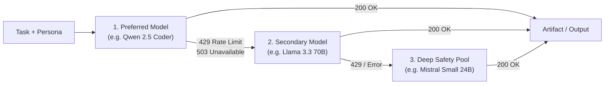

# OpenRouter Free Agents

[](https://github.com/Djoystick/openrouter-free-agents/actions)
[](https://python.org)
[](LICENSE)
[](https://openrouter.ai/)
[-emerald.svg?style=flat-square)](#)

Resilient LLM router and multi-agent orchestrator for OpenRouter's free model tier (`:free`), featuring automatic `HTTP 429` failover, live catalog discovery, and sequential multi-agent pipelines.

---

## The Problem

OpenRouter regularly serves capable open-weight models at zero cost (`:free` suffix, `$0.00` per token) — including **Llama 3.3 70B**, **Qwen 2.5 Coder 32B**, **Mistral Small 24B**, and **Gemini 2.0 Flash Exp**.

However, using free endpoints in scripts or automated pipelines presents three challenges:
1. **Aggressive Rate Limits (`HTTP 429`):** Free models encounter sudden throttling during peak traffic.
2. **Silent Model Deprecation:** Providers appear, disappear, or reconfigure endpoints without prior notice.
3. **Context Length Discrepancies:** Handing tasks to models with small context windows silently truncates prompts.

Standard LLM SDKs throw an unhandled exception or enter long exponential sleep cycles on rate limits.

## The Solution

`openrouter-free-agents` treats OpenRouter's free tier as a dynamic, fault-tolerant pool:
* **Live Discovery:** Queries OpenRouter's `/api/v1/models` endpoint to detect currently active `:free` endpoints and their real context lengths.
* **Cascading Failover:** If a model returns `HTTP 429`, `503`, or times out, the request is immediately rerouted to the next model in the affinity chain without losing prompt context.
* **Role-Based Affinity:** Specific tasks (coding, system architecture, security auditing) are routed to model chains optimized for those domains.
* **Zero Bloat:** Core library uses standard `requests` and `python-dotenv`. No heavy framework dependencies.

---

## Quickstart

### 1. Installation

```bash
git clone https://github.com/Djoystick/openrouter-free-agents.git
cd openrouter-free-agents

# Optional virtual environment
python -m venv venv
source venv/bin/activate  # On Windows: venv\Scripts\activate

pip install -r requirements.txt
pip install -e .
```

### 2. Configuration

Create `.env` with your free OpenRouter API key (no credit card required at [openrouter.ai/keys](https://openrouter.ai/keys)):

```bash
cp .env.example .env
```

```env
OPENROUTER_API_KEY=sk-or-v1-your-key-here

# Optional: HTTP/HTTPS proxy if openrouter.ai is filtered locally
# HTTP_PROXY=http://127.0.0.1:7890
# HTTPS_PROXY=http://127.0.0.1:7890
```

### 3. Usage Examples

**Scan active free models with >= 16k context window:**
```bash
openrouter-agents scan --min-context 16000
```

**Dispatch a task to a specialized agent:**
```bash
openrouter-agents run --role coder --task "Write a Redis token-bucket rate limiter in Python"
```

**Execute a sequential multi-agent pipeline:**
```bash
openrouter-agents pipeline \
  --task "Design and implement an idempotent webhook delivery worker in Python" \
  --roles architect,coder,security
```

---

## Architecture & Failover Logic

When a task is dispatched, the orchestrator traverses the candidate chain until a successful completion (`HTTP 200`) is returned:



* State and system instructions are preserved across retries.
* Every attempt, status code, and latency figure is recorded in the execution log.
* Outputs are automatically persisted to markdown files in `outputs/`.

---

## Python SDK

Integrate the orchestrator directly into your Python services or bots:

### Single Agent Dispatch

```python
from core.swarm import AgentSwarm

swarm = AgentSwarm()

result = swarm.dispatch(
    task="Write a thread-safe connection pool with context manager support.",
    role="coder"
)

print(f"Model used: {result['model_used']}")
print(f"Artifact:   {result['artifact_file']}")
print(result["content"])
```

### Chained Multi-Agent Pipeline

Each subsequent agent receives the cumulative output of preceding agents as architectural context:

```python
from core.swarm import AgentSwarm

swarm = AgentSwarm()

stages = swarm.pipeline(
    task="Design an event-driven telemetry ingest worker with batch flushing.",
    pipeline_roles=["architect", "coder", "security"]
)

for stage in stages:
    print(f"[{stage['role'].upper()}] -> {stage['model_used']} (saved to {stage['artifact_file']})")
```

### Dynamic Model Discovery

```python
from core.monitor import OpenRouterMonitor

monitor = OpenRouterMonitor()
free_models = monitor.get_free_models(min_context=32768)

for model in free_models:
    print(f"- {model['id']} | Context: {model['context_length']:,}")
```

---

## Role Presets & Affinity Chains

Role presets are defined in [`core/roles.py`](core/roles.py):

| Role | Target Domain | Model Affinity Chain | Temperature |
| :--- | :--- | :--- | :---: |
| `coder` | Full-stack implementation, algorithms, unit tests | `qwen-2.5-coder-32b` → `llama-3.3-70b` → `mistral-small` | `0.1` |
| `architect` | System architecture, API contracts, schema design | `llama-3.3-70b` → `nemotron-3-super` → `qwen-coder` | `0.2` |
| `security` | Vulnerability assessment, edge-case hardening | `nemotron-3-super` → `llama-3.3-70b` → `qwen-coder` | `0.1` |
| `reviewer` | Code review, static analysis, refactoring | `llama-3.3-70b` → `qwen-coder` → `gemini-flash` | `0.1` |
| `motion_ui` | CSS layouts, design systems, micro-interactions | `nex-n2.5-pro` → `llama-3.3-70b` → `mistral-small` | `0.3` |
| `general` | General inquiries, research, document summarization | `llama-3.3-70b` → `mistral-small` → `gemini-flash` | `0.2` |

---

## Feature Comparison

| Capability | Raw OpenRouter API | Standard Router (LiteLLM) | openrouter-free-agents |
| :--- | :---: | :---: | :---: |
| Zero-Cost Focus | ❌ Manual filtering | ❌ Manual setup | ✅ Automatic (`:free` filter) |
| Dynamic 429 Cascade | ❌ Throws exception | ⚠️ Requires paid fallbacks | ✅ Native rotation |
| Context-Aware Role Chains | ❌ | ❌ | ✅ Built-in |
| Multi-Stage Pipelines | ❌ | ❌ | ✅ Built-in |
| Dependencies | `requests` | Heavy (`pydantic`, `aiohttp`, etc.) | Lightweight (`requests`, `python-dotenv`) |
| Proxy Support | Manual | Config required | Native via `.env` |

---

## Configuration Reference

Settings can be defined in `.env` or exported in the environment:

| Variable | Type | Default | Description |
| :--- | :---: | :---: | :--- |
| `OPENROUTER_API_KEY` | `string` | *Required* | OpenRouter API Key (`sk-or-v1-...`) |
| `HTTP_PROXY` | `url` | `""` | Optional HTTP proxy |
| `HTTPS_PROXY` | `url` | `""` | Optional HTTPS proxy |
| `DEFAULT_TIMEOUT` | `int` | `90` | Request timeout in seconds |
| `APP_NAME` | `string` | `"OpenRouter Free Agents"` | Client identifier header |

---

<details>
<summary><b>Описание на русском языке (Нажмите, чтобы развернуть)</b></summary>

### Назначение
Библиотека и CLI-утилита для отказоустойчивой работы с бесплатными моделями OpenRouter (`:free`).

### Решаемые задачи:
1. **Автоматический обход ошибки 429:** При исчерпании лимитов или задержках на одном бесплатном провайдере запрос мгновенно перенаправляется на следующую модель из цепочки приоритетов с сохранением системного промпта и контекста.
2. **Мониторинг каталога:** Автоматический опрос `openrouter.ai/api/v1/models` для выявления активных бесплатных эндпоинтов и фильтрации по размеру контекстного окна.
3. **Ролевые пресеты:** Готовые цепочки под задачи разработки (`coder`, `architect`, `security`, `reviewer`).
4. **Конвейер субагентов:** Последовательное выполнение этапов задачи (Архитектор → Программист → Безопасник) с накоплением контекста.
5. **Поддержка прокси:** Простая настройка `HTTP_PROXY` в `.env` для сетей с ограниченным доступом к API.

### Быстрый запуск:
```bash
# Установка
pip install -r requirements.txt
pip install -e .

# Сканирование доступных моделей (контекст от 16k)
openrouter-agents scan --min-context 16000

# Тест задачи
openrouter-agents run --role coder --task "Напиши асинхронный LRU-кэш на Python"
```
</details>

---

## Contributing

Pull requests and issue reports are welcome. To contribute:
1. Fork the repository.
2. Create a feature branch (`git checkout -b feature/model-retry-policy`).
3. Commit your changes (`git commit -m 'feat: improve retry backoff'`).
4. Run tests: `python -m unittest discover -s tests`.
5. Open a Pull Request.

## License

This project is licensed under the [MIT License](LICENSE).
